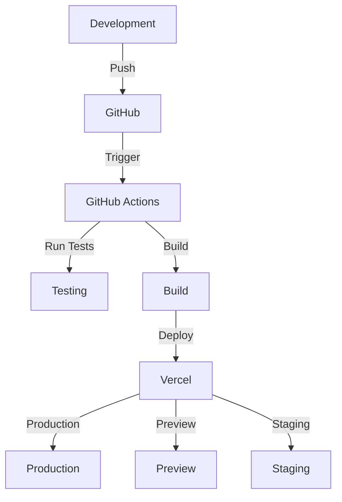

# HotelWebsite_SupaBase Pipeline Documentation

## 🚀 Development Pipeline

### 1. Development Environment Setup
```bash
# Clone the repository
git clone https://github.com/Ali-Ashraf-510/HotelWebsite_SupaBase.git

# Install dependencies
npm install

# Start development server
ng serve
```

### 2. Branch Strategy
- `main` - Production branch
- `develop` - Development branch
- `feature/*` - Feature branches
- `hotfix/*` - Hotfix branches
- `release/*` - Release branches

### 3. Development Workflow
1. Create feature branch from `develop`
2. Implement feature/fix
3. Write/update tests
4. Create Pull Request
5. Code review
6. Merge to `develop`
7. Deploy to staging
8. QA testing
9. Merge to `main`
10. Deploy to production

## 🛠️ Build Pipeline

### 1. Local Build
```bash
# Production build
ng build --configuration production

# Staging build
ng build --configuration staging
```

### 2. Build Optimization
- Tree shaking
- Code splitting
- Lazy loading
- Asset optimization
- Minification
- Compression

## 🚢 Deployment Pipeline

### 1. Vercel Deployment
- Automatic deployment on push to `main`
- Preview deployments for PRs
- Environment variables management
- Custom domains configuration

### 2. Deployment Environments
- Production: `https://hotelstay.vercel.app`
- Staging: `https://staging.hotelstay.vercel.app`
- Preview: `https://[pr-number].hotelstay.vercel.app`

## 🔄 CI/CD Pipeline

### 1. GitHub Actions Workflow
```yaml
name: CI/CD Pipeline

on:
  push:
    branches: [ main, develop ]
  pull_request:
    branches: [ main, develop ]

jobs:
  test:
    runs-on: ubuntu-latest
    steps:
      - uses: actions/checkout@v2
      - name: Install dependencies
        run: npm install
      - name: Run tests
        run: npm test

  build:
    needs: test
    runs-on: ubuntu-latest
    steps:
      - uses: actions/checkout@v2
      - name: Install dependencies
        run: npm install
      - name: Build
        run: npm run build

  deploy:
    needs: build
    runs-on: ubuntu-latest
    steps:
      - name: Deploy to Vercel
        uses: amondnet/vercel-action@v20
        with:
          vercel-token: ${{ secrets.VERCEL_TOKEN }}
          vercel-org-id: ${{ secrets.ORG_ID}}
          vercel-project-id: ${{ secrets.PROJECT_ID }}
```

## 📦 Environment Configuration

### 1. Environment Variables
```env
# Production
SUPABASE_URL=your_production_supabase_url
SUPABASE_KEY=your_production_supabase_key
API_URL=your_production_api_url

# Staging
SUPABASE_URL=your_staging_supabase_url
SUPABASE_KEY=your_staging_supabase_key
API_URL=your_staging_api_url
```

### 2. Configuration Files
- `angular.json` - Angular configuration
- `vercel.json` - Vercel deployment configuration
- `.env` - Environment variables
- `tsconfig.json` - TypeScript configuration

## 🔍 Quality Assurance

### 1. Testing
- Unit Tests: `npm run test`
- E2E Tests: `npm run e2e`
- Coverage Report: `npm run test:coverage`

### 2. Code Quality
- ESLint: `npm run lint`
- Prettier: `npm run format`
- TypeScript: `npm run type-check`

## 📊 Monitoring

### 1. Performance Monitoring
- Vercel Analytics
- Google Analytics
- Error tracking
- Performance metrics

### 2. Logging
- Application logs
- Error logs
- Access logs
- Performance logs

## 🔒 Security

### 1. Security Measures
- HTTPS enforcement
- CSP headers
- XSS protection
- CSRF protection
- Rate limiting
- Input validation

### 2. Security Scanning
- Dependency scanning
- Code scanning
- Vulnerability assessment
- Security headers

## 📈 Scaling

### 1. Infrastructure
- Vercel Edge Network
- CDN integration
- Database scaling
- Cache management

### 2. Performance Optimization
- Image optimization
- Code splitting
- Lazy loading
- Caching strategies

## 🔄 Backup and Recovery

### 1. Database Backup
- Daily automated backups
- Point-in-time recovery
- Backup verification
- Recovery testing

### 2. Disaster Recovery
- Recovery procedures
- Backup restoration
- Failover systems
- Data integrity checks

## 📝 Documentation

### 1. Code Documentation
- JSDoc comments
- README files
- API documentation
- Component documentation

### 2. Process Documentation
- Development guidelines
- Deployment procedures
- Troubleshooting guides
- Security protocols

---

## 🔄 Pipeline Diagram



---

## 📞 Support

For pipeline-related issues or questions:
- Create an issue in the repository
- Contact the DevOps team
- Check the troubleshooting guide
- Review the documentation

---

<div align="center">
  Made with ❤️ by Ali Ashraf
</div> 