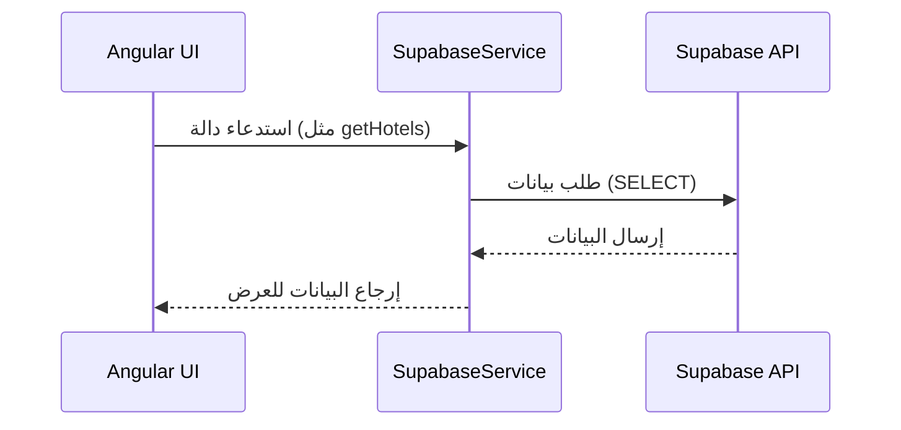

# 🧩 كيف يتم التواصل مع Supabase من خلال تطبيق Angular

هذا المستند يشرح آلية تواصل تطبيق Angular مع خدمة Supabase باستخدام `SupabaseService` المخصص لذلك.

---

## 📁 1. إعداد الاتصال بـ Supabase

```ts
this.supabase = createClient(this.supabaseUrl, this.supabaseKey);
```

- يتم إنشاء عميل Supabase باستخدام `createClient`.
- يتم تزويده بـ URL و Key خاصين بالمشروع.

---

## 👤 2. المصادقة (Authentication)

### 🔐 تسجيل الدخول
```ts
async signIn(email: string, password: string) {
  const response = await this.supabase.auth.signInWithPassword({ email, password });
  this.currentUser.next(response.data.user);
  return response;
}
```

### 📝 إنشاء حساب
```ts
async signUp(email: string, password: string, name: string) {
  const response = await this.supabase.auth.signUp({
    email,
    password,
    options: { data: { name } }
  });
  this.currentUser.next(response.data.user);
  return response;
}
```

### 🚪 تسجيل الخروج
```ts
async signOut() {
  await this.supabase.auth.signOut();
  this.currentUser.next(null);
}
```

### 👁️ الحصول على المستخدم الحالي
```ts
async getCurrentUser() {
  return await this.supabase.auth.getUser();
}
```

---

## 🏨 3. إدارة الفنادق والغرف

### 📦 جلب كل الفنادق
```ts
async getHotels() {
  const { data, error } = await this.supabase
    .from('hotels')
    .select(`
      *,
      rooms (
        count
      ),
      reviews (
        rating
      )
    `)
    .order('name');

  // حساب متوسط التقييم لكل فندق
  const hotelsWithRating = data?.map(hotel => ({
    ...hotel,
    average_rating: hotel.reviews?.length 
      ? hotel.reviews.reduce((acc: number, review: any) => acc + review.rating, 0) / hotel.reviews.length 
      : 0,
    rooms_count: hotel.rooms?.[0]?.count || 0
  }));

  return { data: hotelsWithRating, error: null };
}
```

### 🏨 جلب فندق معين
```ts
async getHotelById(id: string) {
  return await this.supabase
    .from('hotels')
    .select('*')
    .eq('id', id)
    .single();
}
```

### 🛏️ جلب غرف فندق معين
```ts
async getRoomsByHotelId(hotelId: string) {
  return await this.supabase
    .from('rooms')
    .select('*')
    .eq('hotel_id', hotelId);
}
```

### ✅ تحديث حالة التوفر لغرفة
```ts
async updateRoomAvailability(roomId: string, isAvailable: boolean) {
  return await this.supabase
    .from('rooms')
    .update({ is_available: isAvailable })
    .eq('id', roomId);
}
```

---

## 📅 4. إدارة الحجوزات

### ➕ إنشاء حجز
```ts
async createBooking(bookingData: {
  room_id: string;
  check_in: string;
  check_out: string;
  total_price: number;
}) {
  const user = await this.getCurrentUser();
  if (!user.data.user) throw new Error('User not authenticated');

  return await this.supabase
    .from('bookings')
    .insert({
      user_id: user.data.user.id,
      room_id: bookingData.room_id,
      check_in: bookingData.check_in,
      check_out: bookingData.check_out,
      total_price: bookingData.total_price,
      status: 'pending',
      payment_status: 'pending'
    });
}
```

### 📄 جلب حجوزات المستخدم
```ts
async getUserBookings() {
  const user = await this.getCurrentUser();
  if (!user.data.user) throw new Error('User not authenticated');

  return await this.supabase
    .from('bookings')
    .select(`
      *,
      rooms (
        *,
        hotels (*)
      )
    `)
    .eq('user_id', user.data.user.id);
}
```

### 🔄 تحديث حالة الحجز / الدفع
```ts
async updateBookingStatus(bookingId: string, status: string) {
  return await this.supabase
    .from('bookings')
    .update({ status })
    .eq('id', bookingId);
}

async updatePaymentStatus(bookingId: string, paymentStatus: string) {
  return await this.supabase
    .from('bookings')
    .update({ payment_status: paymentStatus })
    .eq('id', bookingId);
}
```

---

## 🌟 5. التقييمات

### ✍️ إنشاء تقييم
```ts
async createReview(reviewData: {
  hotel_id: string;
  rating: number;
  comment: string;
}) {
  const user = await this.getCurrentUser();
  if (!user.data.user) throw new Error('User not authenticated');

  return await this.supabase
    .from('reviews')
    .insert({
      user_id: user.data.user.id,
      hotel_id: reviewData.hotel_id,
      rating: reviewData.rating,
      comment: reviewData.comment
    });
}
```

### 👁️ عرض التقييمات لفندق
```ts
async getHotelReviews(hotelId: string) {
  return await this.supabase
    .from('reviews')
    .select(`
      *,
      users (name)
    `)
    .eq('hotel_id', hotelId);
}
```

---

## 🧠 الخلاصة

1. **SupabaseService** في Angular يحتوي على كل الوظائف التي تتعامل مع Supabase.
2. كل وظيفة تتعامل مباشرة مع الجداول باستخدام `supabase.from('table')`.
3. تتم المصادقة وإدارة الجلسات باستخدام `supabase.auth`.
4. يتم استخدام `BehaviorSubject` لتتبع حالة المستخدم الحالي.

---

## 🔄 سير التواصل (Data Flow)


