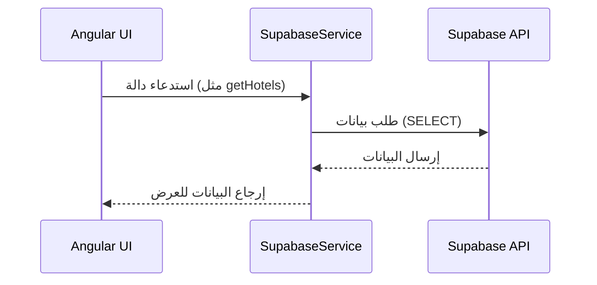

# 🧩 كيف يتم التواصل مع Supabase من خلال تطبيق Angular

هذا المستند يشرح آلية تواصل تطبيق Angular مع خدمة Supabase باستخدام `SupabaseService` المخصص لذلك.

---

## 📁 1. إعداد الاتصال بـ Supabase

```ts
this.supabase = createClient(this.supabaseUrl, this.supabaseKey);
```

**الشرح**: يتم إنشاء عميل Supabase عند بدء تشغيل التطبيق. يتم تخزين الـ URL و Key في متغيرات خاصة بالخدمة.

**المستخدم في**: يتم استخدامه في `app.module.ts` عند تهيئة التطبيق.

---

## 👤 2. المصادقة (Authentication)

### 🔐 تسجيل الدخول
```ts
async signIn(email: string, password: string) {
  const response = await this.supabase.auth.signInWithPassword({ email, password });
  this.currentUser.next(response.data.user);
  return response;
}
```

**الشرح**: تقوم بتسجيل دخول المستخدم باستخدام البريد الإلكتروني وكلمة المرور، وتحديث حالة المستخدم الحالي.

**المستخدم في**: `login.component.ts` - صفحة تسجيل الدخول

### 📝 إنشاء حساب
```ts
async signUp(email: string, password: string, name: string) {
  const response = await this.supabase.auth.signUp({
    email,
    password,
    options: { data: { name } }
  });
  this.currentUser.next(response.data.user);
  return response;
}
```

**الشرح**: تقوم بإنشاء حساب جديد للمستخدم مع تخزين اسمه في البيانات الإضافية.

**المستخدم في**: `register.component.ts` - صفحة إنشاء حساب جديد

### 🚪 تسجيل الخروج
```ts
async signOut() {
  await this.supabase.auth.signOut();
  this.currentUser.next(null);
}
```

**الشرح**: تقوم بتسجيل خروج المستخدم وتحديث حالة المستخدم الحالي إلى null.

**المستخدم في**: `navbar.component.ts` - زر تسجيل الخروج في شريط التنقل

### 👁️ الحصول على المستخدم الحالي
```ts
async getCurrentUser() {
  return await this.supabase.auth.getUser();
}
```

**الشرح**: تقوم بجلب بيانات المستخدم المسجل دخوله حالياً.

**المستخدم في**: 
- `auth.guard.ts` - للتحقق من حالة المصادقة
- `profile.component.ts` - لعرض بيانات المستخدم
- `booking.component.ts` - للتحقق من المستخدم قبل إنشاء حجز

---

## 🏨 3. إدارة الفنادق والغرف

### 📦 جلب كل الفنادق
```ts
async getHotels() {
  const { data, error } = await this.supabase
    .from('hotels')
    .select(`
      *,
      rooms (
        count
      ),
      reviews (
        rating
      )
    `)
    .order('name');

  // حساب متوسط التقييم لكل فندق
  const hotelsWithRating = data?.map(hotel => ({
    ...hotel,
    average_rating: hotel.reviews?.length 
      ? hotel.reviews.reduce((acc: number, review: any) => acc + review.rating, 0) / hotel.reviews.length 
      : 0,
    rooms_count: hotel.rooms?.[0]?.count || 0
  }));

  return { data: hotelsWithRating, error: null };
}
```

**الشرح**: تقوم بجلب جميع الفنادق مع عدد الغرف والتقييمات، وحساب متوسط التقييم لكل فندق.

**المستخدم في**: 
- `home.component.ts` - لعرض الفنادق المميزة في الصفحة الرئيسية
- `hotels.component.ts` - لعرض قائمة الفنادق

### 🏨 جلب فندق معين
```ts
async getHotelById(id: string) {
  return await this.supabase
    .from('hotels')
    .select('*')
    .eq('id', id)
    .single();
}
```

**الشرح**: تقوم بجلب بيانات فندق محدد باستخدام معرفه.

**المستخدم في**: `hotel-details.component.ts` - لعرض تفاصيل الفندق

### 🛏️ جلب غرف فندق معين
```ts
async getRoomsByHotelId(hotelId: string) {
  return await this.supabase
    .from('rooms')
    .select('*')
    .eq('hotel_id', hotelId);
}
```

**الشرح**: تقوم بجلب جميع الغرف المتاحة في فندق محدد.

**المستخدم في**: 
- `hotel-details.component.ts` - لعرض الغرف المتاحة
- `booking.component.ts` - لاختيار الغرفة للحجز

### ✅ تحديث حالة التوفر لغرفة
```ts
async updateRoomAvailability(roomId: string, isAvailable: boolean) {
  return await this.supabase
    .from('rooms')
    .update({ is_available: isAvailable })
    .eq('id', roomId);
}
```

**الشرح**: تقوم بتحديث حالة توفر الغرفة (متاحة/غير متاحة).

**المستخدم في**: `admin/rooms.component.ts` - لإدارة حالة الغرف من قبل المشرف

---

## 📅 4. إدارة الحجوزات

### ➕ إنشاء حجز
```ts
async createBooking(bookingData: {
  room_id: string;
  check_in: string;
  check_out: string;
  total_price: number;
}) {
  const user = await this.getCurrentUser();
  if (!user.data.user) throw new Error('User not authenticated');

  return await this.supabase
    .from('bookings')
    .insert({
      user_id: user.data.user.id,
      room_id: bookingData.room_id,
      check_in: bookingData.check_in,
      check_out: bookingData.check_out,
      total_price: bookingData.total_price,
      status: 'pending',
      payment_status: 'pending'
    });
}
```

**الشرح**: تقوم بإنشاء حجز جديد مع التحقق من تسجيل دخول المستخدم.

**المستخدم في**: `booking.component.ts` - لإنشاء حجز جديد

### 📄 جلب حجوزات المستخدم
```ts
async getUserBookings() {
  const user = await this.getCurrentUser();
  if (!user.data.user) throw new Error('User not authenticated');

  return await this.supabase
    .from('bookings')
    .select(`
      *,
      rooms (
        *,
        hotels (*)
      )
    `)
    .eq('user_id', user.data.user.id);
}
```

**الشرح**: تقوم بجلب جميع حجوزات المستخدم مع تفاصيل الغرف والفنادق.

**المستخدم في**: 
- `profile.component.ts` - لعرض حجوزات المستخدم
- `my-bookings.component.ts` - لعرض قائمة الحجوزات

### 🔄 تحديث حالة الحجز / الدفع
```ts
async updateBookingStatus(bookingId: string, status: string) {
  return await this.supabase
    .from('bookings')
    .update({ status })
    .eq('id', bookingId);
}

async updatePaymentStatus(bookingId: string, paymentStatus: string) {
  return await this.supabase
    .from('bookings')
    .update({ payment_status: paymentStatus })
    .eq('id', bookingId);
}
```

**الشرح**: تقوم بتحديث حالة الحجز (معلق/مؤكد/ملغي) وحالة الدفع.

**المستخدم في**: 
- `admin/bookings.component.ts` - لإدارة الحجوزات من قبل المشرف
- `payment.component.ts` - لتحديث حالة الدفع

---

## 🌟 5. التقييمات

### ✍️ إنشاء تقييم
```ts
async createReview(reviewData: {
  hotel_id: string;
  rating: number;
  comment: string;
}) {
  const user = await this.getCurrentUser();
  if (!user.data.user) throw new Error('User not authenticated');

  return await this.supabase
    .from('reviews')
    .insert({
      user_id: user.data.user.id,
      hotel_id: reviewData.hotel_id,
      rating: reviewData.rating,
      comment: reviewData.comment
    });
}
```

**الشرح**: تقوم بإنشاء تقييم جديد للفندق مع التحقق من تسجيل دخول المستخدم.

**المستخدم في**: `review.component.ts` - لإضافة تقييم جديد

### 👁️ عرض التقييمات لفندق
```ts
async getHotelReviews(hotelId: string) {
  return await this.supabase
    .from('reviews')
    .select(`
      *,
      users (name)
    `)
    .eq('hotel_id', hotelId);
}
```

**الشرح**: تقوم بجلب جميع التقييمات لفندق محدد مع أسماء المستخدمين.

**المستخدم في**: 
- `hotel-details.component.ts` - لعرض تقييمات الفندق
- `reviews.component.ts` - لعرض قائمة التقييمات

---

## 🧠 الخلاصة

1. **SupabaseService** في Angular يحتوي على كل الوظائف التي تتعامل مع Supabase.
2. كل وظيفة تتعامل مباشرة مع الجداول باستخدام `supabase.from('table')`.
3. تتم المصادقة وإدارة الجلسات باستخدام `supabase.auth`.
4. يتم استخدام `BehaviorSubject` لتتبع حالة المستخدم الحالي.

---

## 🔄 سير التواصل (Data Flow)


