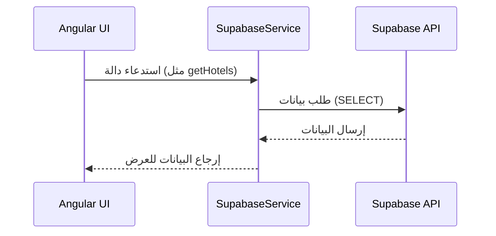

# 🧩 كيف يتم التواصل مع Supabase من خلال تطبيق Angular

هذا المستند يشرح آلية تواصل تطبيق Angular مع خدمة Supabase باستخدام `SupabaseService` المخصص لذلك.

---

## 📁 1. إعداد الاتصال بـ Supabase

```ts
this.supabase = createClient(this.supabaseUrl, this.supabaseKey);
```

- يتم إنشاء عميل Supabase باستخدام `createClient`.
- يتم تزويده بـ URL و Key خاصين بالمشروع.

---

## 👤 2. المصادقة (Authentication)

### 🔐 تسجيل الدخول
```ts
supabase.auth.signInWithPassword({ email, password });
```

### 📝 إنشاء حساب
```ts
supabase.auth.signUp({
  email,
  password,
  options: { data: { name } }
});
```

### 🚪 تسجيل الخروج
```ts
supabase.auth.signOut();
```

### 👁️ الحصول على المستخدم الحالي
```ts
supabase.auth.getUser();
```

---

## 🏨 3. إدارة الفنادق والغرف

### 📦 جلب كل الفنادق
```ts
supabase.from('hotels').select(`*, rooms(count), reviews(rating)`)
```

### 🏨 جلب فندق معين
```ts
supabase.from('hotels').select('*').eq('id', id)
```

### 🛏️ جلب غرف فندق معين
```ts
supabase.from('rooms').select('*').eq('hotel_id', hotelId)
```

### ✅ تحديث حالة التوفر لغرفة
```ts
supabase.from('rooms').update({ is_available }).eq('id', roomId)
```

---

## 📅 4. إدارة الحجوزات

### ➕ إنشاء حجز
```ts
supabase.from('bookings').insert({ ... })
```

### 📄 جلب حجوزات المستخدم
```ts
supabase.from('bookings').select(`*, rooms(*, hotels(*))`).eq('user_id', userId)
```

### 🔄 تحديث حالة الحجز / الدفع
```ts
supabase.from('bookings').update({ status }).eq('id', bookingId)
supabase.from('bookings').update({ payment_status }).eq('id', bookingId)
```

---

## 🌟 5. التقييمات

### ✍️ إنشاء تقييم
```ts
supabase.from('reviews').insert({ user_id, hotel_id, rating, comment })
```

### 👁️ عرض التقييمات لفندق
```ts
supabase.from('reviews').select(`*, users(name)`).eq('hotel_id', hotelId)
```

---

## 🧑‍💼 6. الملف الشخصي

### تحديث الملف الشخصي
```ts
supabase.from('users').update(profileData).eq('id', userId)
```

### جلب الملف الشخصي
```ts
supabase.from('users').select('*').eq('id', userId).single()
```

---

## 🧠 الخلاصة

1. **SupabaseService** في Angular يحتوي على كل الوظائف التي تتعامل مع Supabase.
2. كل وظيفة تتعامل مباشرة مع الجداول باستخدام `supabase.from('table')`.
3. تتم المصادقة وإدارة الجلسات باستخدام `supabase.auth`.

---

## 🔄 سير التواصل (Data Flow)


